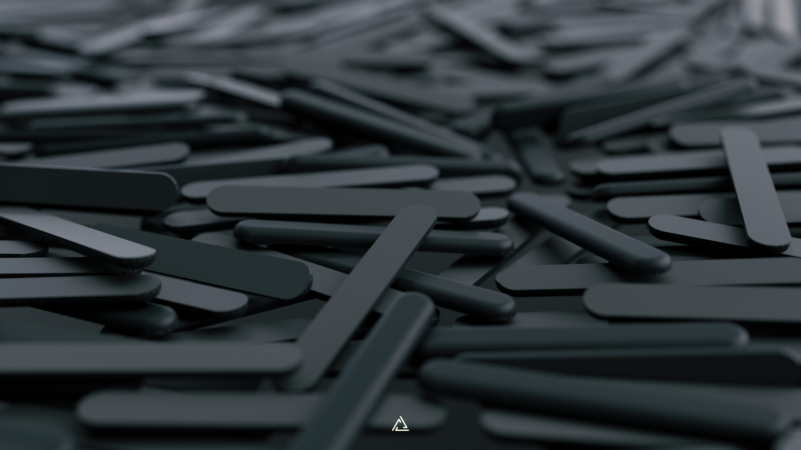
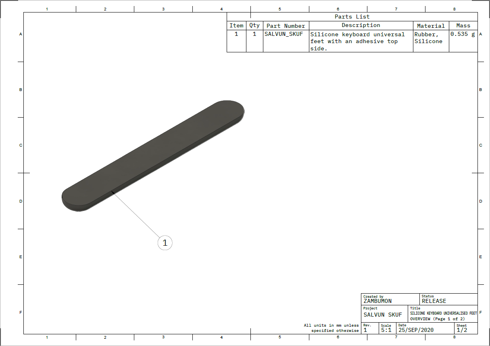
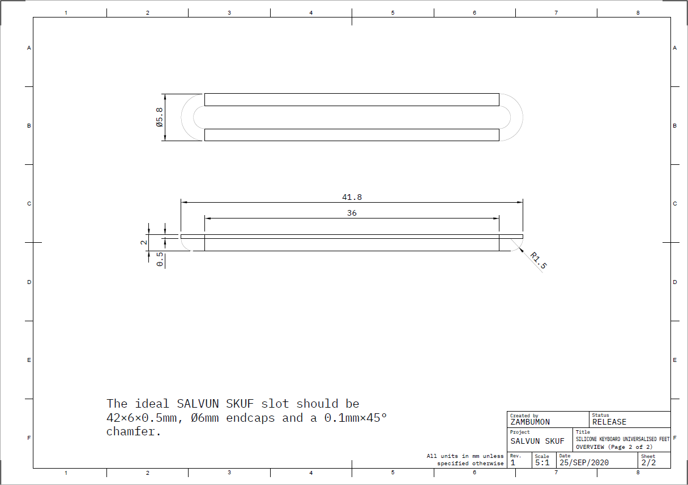
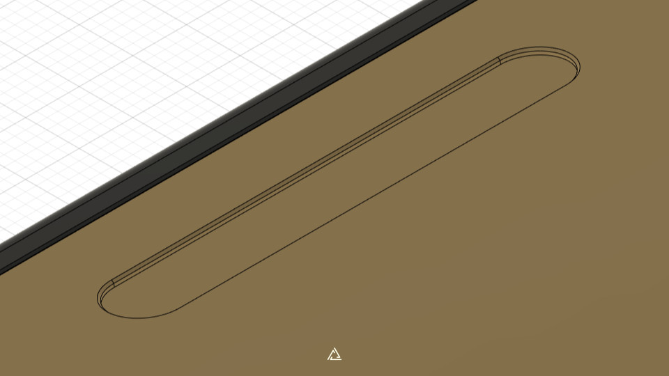
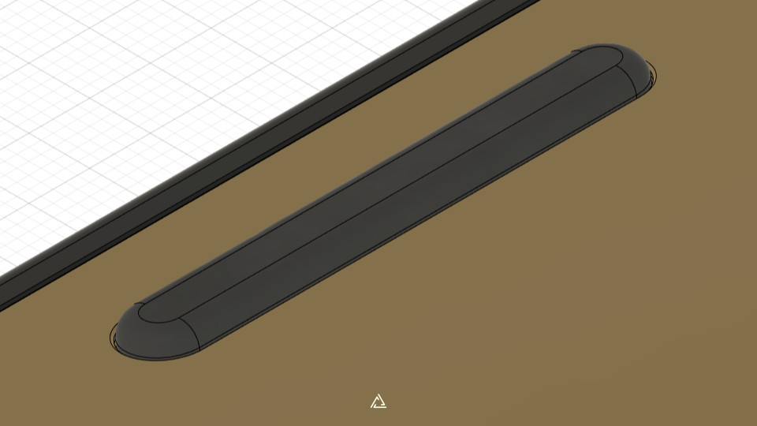

# Silicone Keyboard Universalised Feet

## Preface

The Silicone Keyboard Universalised Feet project is an attempt to standardize the rubber feet used for custom mechanical keyboard projects. It has initially been envisioned by users Salvun, Soran, Wilba and Zambumon.

This project hosts the implemenation used by Salvun.

## Using SKUF with your own keyboard

The reference files for the SKUF are located on the [production directory](./production/).

The ideal SALVUN SKUF slot should be **42×6×0.5mm, Ø6mm endcaps and a 0.1mm×45° chamfer.**

## Credits

- [Salvun](https://salvun.com/)
- [Soran](https://twitter.com/soran2202)
- [Wilba](https://github.com/Wilba6582)
- [Zambumon](https://github.com/Zambumon)
